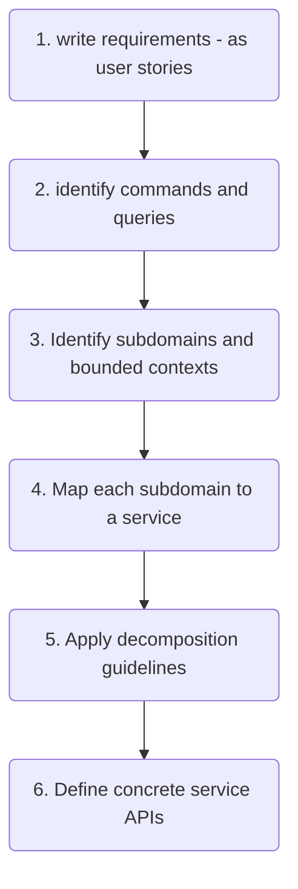

# Software Architecture and Platforms - a.y. 2023-2024

## Lab #06-20231020 - [Repo](https://github.com/pslab-unibo/sap-2023-2024.git) 

In [previous lab (20231016)](https://github.com/pslab-unibo/sap-2023-2024/blob/master/Labs/Lab-05-20231016/README.md),
we focused on the hexagonal/ports & adapters architecture, as a monolithic architecture.

 In this lab, we move to distributed architectures introducing [Microservices](https://docs.google.com/document/d/1k6xXXp0fw8D9ufqlhcAXV89_oFeVUlq98-pT0MtbHM0/edit?usp=sharing), a main reference nowdays for engineering complex distributed systems.

Activity 

- First discussion about a microservices based design for the EScooter case study

### Why microservices?

Monolith applications := large applications that are built as a single deployable unit.

In the beginning:

- simple to develop
- easy to make radical changes to the application
- straightforward to test and deploy
- easy to scala: running a multiple instance of the app behind a load balancer

As the application grows in size and complexity => **monolithic hell**:

- it is too large for any developer to fully understand / tested
- fixing bugs or adding new features is slow and risky: edit + build + test loop takes a long time
- may developers: parallel development with painful merge => integration hell
- scaling is difficult: different modules have conflicting resource requirements. For example, a module needs lots of memory while other module lots of CPU; since it is a single deployment unit, it is impossible to scale them independently => must compromise on the server configuration

> **_Software architectures have very little to do with functional requirements._**
> **_You can implement a set of use cases with any architecture._**
> **_Architecture matters, because of how it affects the so-called quality of service requirements, also called non-functional requirements, quality-attributes or ilities._**
> 
> [Microservices Patterns]

- **X-axis scaling**: scaling by replicating the entire application behind a load balancer
  ```plaintext
                             |--> entire app instance 1
  client --> load balancer --|--> entire app instance 2
                             |--> entire app instance 3
  ```
- **Z-axis scaling**: scaling by partitioning the data set each service manages
  ```plaintext
                      |--> app instance 1: users from A to H
  client --> router --|--> app instance 2: users from I to P
                      |--> app instance 3: users from R to Z
  ```
- **Y-axis scaling**: scaling decomposing by functionality. A service is a mini application that implements narrowly focused functionality. A service is scaled using X-axis though some services may also use Z-axis
  ```plaintext
                                                  |--> order service instance 1
           |--> order service --> load balancer --|--> order service instance 2
           |                                      |--> order service instance 3
  client --|--> customer service
           |
           |--> review service
  ```

Microservice architecture := architectural style that functionally decomposes an application into a set of services with a **focused, cohesive set of responsibilities** ("micro" is not related to the dimension of each service) (style, services are components and the connectors are the protocols enabling services to collaborate). The unit of deployment is the service.

- C&C view: components are services
- services have an impermeable boundary, i.e., an API
- C&C view: connectors are the communication protocols
- services are **loosely coupled** and communicate **only via API** (i.e. a developer can't write code that bypasses its API)
  - each service has its own database => at development time developers of one service don't have to coordinate with developers of other services
- each service has its own logical architecture, typically **hexagonal / ports & adapters architecture**
- each service can be independently developed, tested, deployed and scaled (Devops cycle), usually more easily since decomposing leads to smaller services
- microservices have better fault isolation (for example, a memory leak in one service affects only that service) and allow for experimenting with new technologies more easily

=> **Microservice architecture** _enables_ **organization**, i.e. small autonomous cross-functional teams. Organization _enables_ **Devops / Continuous delivery and deployment** => "Move fast without breaking things!"

Cons:
- no well-defined algorithm for decomposing a system into services
- each service has an API to be designed, and each service has its own database, making a challenge to implement transactions that span services => consistency problem
- coordination between teams

On the concept of libraries & shared kernel (DDD): we should strive to use libraries for functionality that's unlikely to change
- for example, `Money` class (probably won't change and its management is common to all services) => good for libraries
- **not** good for `Order` or domain-specific stuffs that will probably change over time (consider the effort to rebuild and redeploy) and are project-specific.

### How to decompose a system into services?



- API:
  - **commands**: operations that create, update or delete data
  - **queries**: operations that read data
  - be _agnostic_ about the underlying IPC mechanism (HTTP, ReST, gRPC, etc.)
- [Example: the subdomains of an online store](https://microservices.io/patterns/decomposition/decompose-by-subdomain.html#examples):
  - product catalog
  - inventory management
  - order management
  - delivery management
  - ...
- Note about subdomain and bounded contexts:
  - 
    - "Domains and subdomains are **problem space concept**s that focus on the specific areas of expertise or knowledge within a business or organization."
    - "bounded contexts are **solution space concepts** that are **used to organize and structure the software system** that is being developed to solve the problems in the domain and subdomains"
      - A bounded context is a specific area within a domain where a specific set of concepts, terms, and rules apply, and where a specific language is used to communicate
    - Ref: [The difference between domains, subdomains and bounded contexts](https://ddd-practitioners.com/2023/03/07/the-difference-between-domains-subdomains-and-bounded-contexts/)
- Guidelines (principle of OOP applies):
  - _Single Responsibility Principle_: create small cohesive services with a single responsibility;
  - _Common Closure Principle_: package components that change for the same reason together => minimize the number of services that need to be changed and deployed when a requirement changes;
  - _Beware of network latencies_: if two services need to communicate frequently should be considered to merge them into a single service, replacing expensive IPC with method calls;
  - _Synchronous IPC reduces availability_: if one service needs to interact with another which is down, using synchronous IPC (like HTTP-based), the caller blocks => _consider asynchronous IPC_;
  - _Maintain data consistency across services_: if a transaction spans multiple services, it is challenging to maintain consistency => _eventual consistency_ (Saga pattern).
- When designing the API consider the APIs required to support collaboration between services
